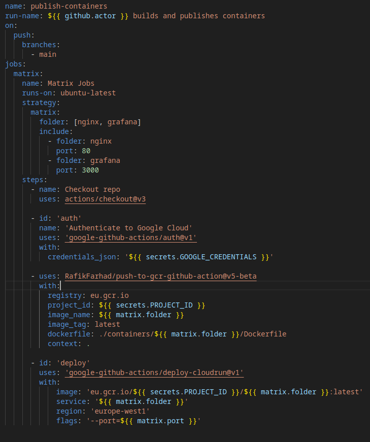

# projetb3
Github automation for Containers deployments

This project is a part of the B3 year, and its goal is to setup a CI/CD pipeline for a containerised application.

Thanks to Github automations, we can deploy our application on a Cloud Run instance, and build it prior to the deployement on a Github Action container.

The built containers will be published on a private registry, and the Cloud Run instance will pull the latest version of the container.

## How to use this automation

When making a new release, you can use the Github Actions workflow to build and publish your container. Beforehand, it is recommanded to test and build your container locally. A working container will more likely work on the first try, and can be integrated into the action workflow.

In the **/containers** folder, you will find the Dockerfiles for the different containers. This directory is accessible by the workflow, and the containers will be built from there, if explicitly specified.

The containers will be named after the **/containers** subdirectories, and will be tagged with the **latest** version tag.

The **folder** parameter is the name of the subdirectory in **/containers**. It is used to specify which container to build and publish. This job will be done in parallel for each container. The **include** parameter is used to specify which port to specify for the cloud run deployement. A wrong port will cause the deployement to fail.

## Secrets and environment variables

The secrets variables used here are the following:

- **GOOGLE_CREDENTIALS**: The credentials for the service account used to deploy the container on Cloud Run. This service account must have the **Cloud Run Admin** role. It is a json service account key that you can obtain from the Google Cloud Console.

- **PROJECT_ID**: The project ID of the project where the Cloud Run instance is deployed. This is used to specify the project where the container will be deployed, and it needs valid credentials to work.